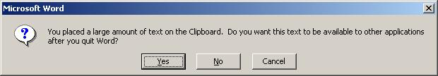
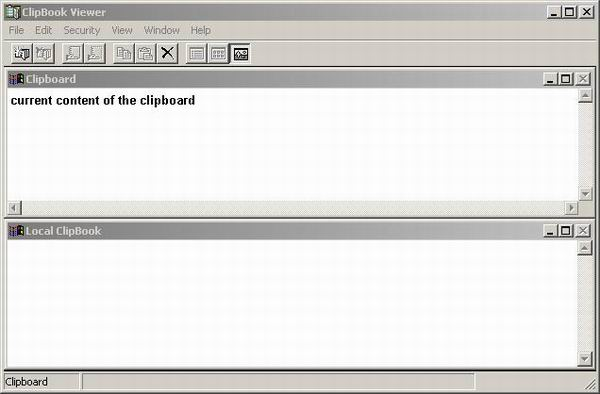
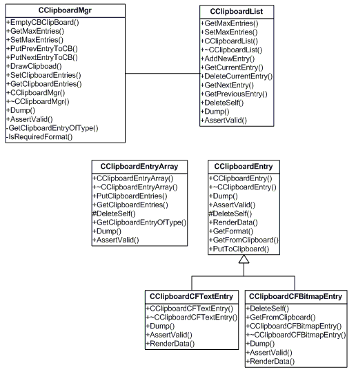
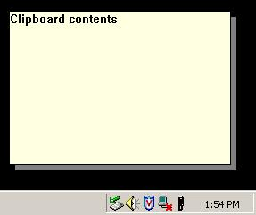
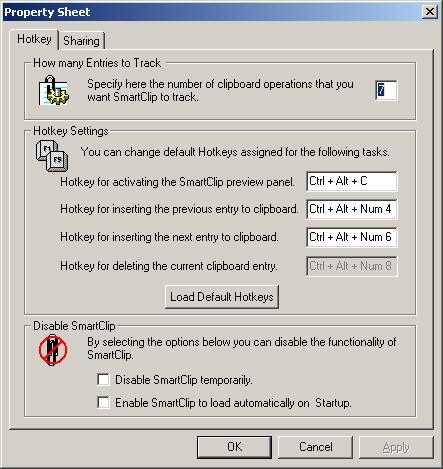
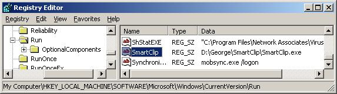

## SmartClip
This is a Windows system-tray based clipboard utility called 'SmartClip' that can extend the Windows clipboard functionality by adding the ability to store multiple clipboard entries.

p.s. This is based on an article that I published in [here](https://www.codeproject.com/Articles/6842/SmartClip-A-Clipboard-enhancement-utility)

### Benefit of SmartClip 
The native clipboard capability becomes very cumbersome if you want to manipulate a lot of different clipboard items. Every time you cut or copy, the new data overwrites the previous clipboard contents. SmartClip enhances the regular clipboard functionality in Windows by capturing every piece of data that you copy to the clipboard, and storing it internally. Once the data is in the SmartClip, you can select an item from the SmartClip using a hotkey - this item is automatically placed back on the clipboard, ready to be pasted into any application. You can preview the current clipboard content on the 'Preview Panel' (a hot key activated clipboard viewer).

### How it helps
The main advantages of SmartClip is that it is designed to be as non-intruding as possible to the user's current activity. It provides Global Hotkeys, which eliminates any mouse operation to activate its most used features. The user will not lose the keyboard focus, even when the clipboard preview panel (described later) is activated. Also, SmartClip is very conservative on its memory usage and will not hog any system resources. It does not require any elaborate installation. Just copy it to a directory and launch it.

### How it works
In order to explain this utility, I will explain the basics of Windows Clipboard. If you are familiar with the concepts of how the clipboard works, you can skip this section and go directly to SmartClip architecture.

#### Windows Clipboard
'Clipboard' is a set of functions exposed by Windows to let applications transfer data across or within applications. In essence, it is a piece of memory that is managed by Windows.

#### Putting data into clipboard
If an application wants to put some data into clipboard, it involves the following steps:

1. The application will have to 'open' the clipboard using the `OpenClipboard` function. This function also prevents other applications from modifying the clipboard.
2. The second step is to empty the current clipboard contents by calling the `EmptyClipboard` function. This also makes the current application the owner of the clipboard.
3. The next step is to call `SetClipboardData` function to set the data into clipboard. When we place some data into clipboard, we must also specify its format. An application can also put the same data into clipboard in multiple formats. For this, the application will have to call `SetClipboardData` once for each format it provides. We will elaborate on clipboard formats in the next section.
4. The final step involves closing the clipboard by calling the `CloseClipboard` function.

The following is a sample code that explains how we can put textual data into clipboard.

```cpp
// An example that shows how to put 'Text' data into clipboard
// pTxtData -> memory pointer that contains the text to be copied
BOOL PutTextToClipboard(LPCTSTR pTxtData)
{
    // Open the clipboard - We pass in the Main window handle
    if (!OpenClipboard( AfxGetMainWnd() )) 
        return FALSE; 

    // Now that we have opened the clipboard, we empty its contenst.
    // Calling this function also makes the current application the
    // owner of the clipboard
    EmptyClipboard(); 

    // Allocate a global memory object for the text to be copied. 
    HGLOBAL hglbCopy = GlobalAlloc(GMEM_MOVEABLE, lstrlen(pTxtData)); 

    // Lock the handle and copy the text to the buffer. 
    LPTSTR lptstrCopy = GlobalLock(hglbCopy); 
    memcpy(lptstrCopy, pTxtData, lstrlen(pTxtData)); 
    GlobalUnlock(hglbCopy); 

    // Place the handle on the clipboard. 
    // CF_TEXT is a standard clipboard format defined by Windows
    SetClipboardData(CF_TEXT, hglbCopy); 

    // Close the clipboard. 
    CloseClipboard(); 
    return TRUE; 
}
```

Now that we have learned how to put content into the clipboard, we will proceed to the next section that will explain why we need different Clipboard formats.

#### Getting Data from clipboard
If an application wants to get some data from clipboard, it involves the following steps:

1. Once again, it should 'open' the clipboard by calling the `OpenClipboard` function.
2. The next step is to determine which of the available clipboard formats to retrieve.
3. Once we know which format to get, we retrieve the handle to the data in the selected format by calling the `GetClipboardData` function.
4. The handle returned by `GetClipboardData` is still owned by the clipboard, so an application must not free it or leave it locked. So, it should take a copy of data from the handle.
5. The last step as before is to close the clipboard by calling the `CloseClipboard` function.

The following sample code explains how we can get textual data from the clipboard:

```cpp
// An example that shows how to get 'Text' data into clipboard
// Returns the data got from the Clipboard, if not NULL
LPCTSTR GetTextFromClipboard()
{
    LPCTSTR   = NULL;

    // Check if the clipboard contains textual data
    // CF_TEXT is a standard clipboard format for TEXT 
    // defined in Winuser.h
    if (!IsClipboardFormatAvailable(CF_TEXT)) 
        return strTxtData;

    // Open the clipboard
    if (!OpenClipboard(hwndMain)) 
        return strTxtData; 

    // Get the handle of the Global memory that contains the text
    HGLOBAL hglb = GetClipboardData(CF_TEXT); 
    if (hglb != NULL) 
    { 
        // Get the size of the data
        SIZE_T DataSize = GlobalSize(hData);
        LPTSTR lptstr = GlobalLock(hglb); 
        if (lptstr != NULL) 
        { 
            // Allocate data and copy the data
            strTxtData = new BYTE[DataSize];
            memcpy(strTxtData, lptstr, DataSize);
            GlobalUnlock(hglb); 
        } 
    } 

    // before returning close the clipboard
    CloseClipboard(); 

    return strTxtData; 
}
```

#### Clipboard formats
For any other application to use the data that you have put into the clipboard, it needs to understand the 'format' in which the data is kept. To facilitate this, when we call the `SetClipboardData` function, we must also specify the format of the data. Windows has predefined some clipboard formats and they are called 'Standard Clipboard Formats'. Examples of such predefined formats are:

* `CF_TEXT` - Text format. Each line ends with a carriage return/linefeed (CR-LF) combination. A null character signals the end of the data. Use this format for ANSI text.
* `CF_BITMAP` - A handle to a bitmap (HBITMAP). Etc.

It is recommended that when an application puts some data into clipboard, it should do so in as many formats as possible. For example, when someone copies a cell in MS Excel, it puts the same data in more than 20 different clipboard formats (internally calling `SetClipboardData` for that many times) including `CF_BITMAP`. This explains why we are able to 'paste' the contents copied from Excel even into MSPaint. One might wonder if it is really efficient to keep so many copies of same data (but in different formats) in memory. 'Delayed Rendering' is used to solve this problem.

#### Advanced clipboard capabilities - Delayed rendering
When placing a clipboard format on the clipboard, an application can delay rendering the data in that format until the data is needed. To do so, an application can specify `NULL` for the hData parameter of the `SetClipboardData` function. This is useful if the application supports several clipboard formats, some or all of which are time-consuming to render. By passing a `NULL` handle, a window renders complex clipboard formats only when and if they are needed.

If a window delays rendering a clipboard format, it must be prepared to render the format upon request for as long as it is the clipboard owner. The system sends the clipboard owner a `WM_RENDERFORMAT` message when a request is received for a specific format that has not been rendered. Upon receiving this message, the window should call the `SetClipboardData` function to place a global memory handle on the clipboard in the requested format. If the clipboard owner is destroyed and has delayed rendering some or all clipboard formats, it receives the `WM_RENDERALLFORMATS` message. Upon receiving this message, the window should place valid memory handles on the clipboard for all clipboard formats that it provides. This ensures that these formats remain available after the clipboard owner is destroyed. Microsoft Office applications use 'delayed rendering' to avoid memory wastage while putting so many formats into clipboard. If you try copying a lot of stuff from within MSWord just before closing it, you will receive the following message.


This is a visual indication of MSWord internally using 'delayed rendering'.

#### Clipboard viewer and Clipboard viewer chain
A clipboard viewer is a window that displays the current content of the clipboard. The ClipBook viewer found in %windir%\system32\clipbrd.exe is an example of a clipboard viewer. When the content of the clipboard changes, the system sends a `WM_DRAWCLIPBOARD` to the registered clipboard viewer.



A clipboard viewer chain is the linking together of two or more clipboard viewers so that they are dependent upon one another for operation. This interdependency (chain) allows all running clipboard viewer applications to receive the messages sent to the current clipboard. An application window can add itself to the clipboard viewer chain by calling the `SetClipboardViewer` function. The return value is the handle to the next clipboard viewer window in the chain. Each clipboard viewer window must keep track of the next window in the clipboard viewer chain. Before closing, a clipboard viewer window must remove itself from the clipboard viewer chain by calling the `ChangeClipboardChain` function. The system then sends a `WM_CHANGECBCHAIN` message to the first window in the chain. Now that we have understood the basics of Windows clipboard, let us move forward to the architecture of SmartClip.

### SmartClip architecture
As mentioned before, SmartClip is a system-tray based application. As the primary objective of our application is to capture and store clipboard contents, we need to be notified whenever there is a change in the clipboard contents. For this, we register ourselves as a clipboard viewer.

```cpp
// Enter the Clipboard Viewer Chain
m_hWndNextViewer = SetClipboardViewer();
```

This ensures that whenever the contents of the clipboard change, we will get notified through the `CWnd::OnDrawClipboard` method. In our implementation of this method, we ask the instance of `CClipboardMgr` to save a copy of whatever was put into the clipboard. We then pass on the message to the next clipboard viewer in the chain as follows:

```cpp
void CMainFrame::OnDrawClipboard() 
{
    CFrameWnd::OnDrawClipboard();

    if(m_bEnabled)
    {
        HWND hOwner = ::GetClipboardOwner();
        if(hOwner != m_hWnd)
        {
            // Capture the data!!
            m_ClipboardMgr.GetClipboardEntries();
        }
        // Pass the message to the Next Viewer
        ::SendMessage(m_hWndNextViewer, WM_DRAWCLIPBOARD,
                                                NULL, NULL);
    }
    Invalidate();
}
```
### How much to save?
We should note that each time someone wants to put something into the clipboard, they would want to do so in as many formats as possible. Normally, this would not cause a memory overhead, as the clipboard owner will not render all these formats unless some one specifically asks for a format. If our policy is to save a copy of whatever is put into clipboard, it is obvious that this will result in a lot of memory wastage. Let us take Excel copying something into clipboard as a sample scenario. Excel will store the data in more than 20 different formats (Excel internally optimizes the memory usage using delayed rendering). The average size of data for a specific format could be assumed to be around 200 Kb (quite possible, if it is a large selection). If SmartClip decides to keep a copy of all the formats, it would result in around 4 Mb of data in memory. Since SmartClip keeps copies of multiple clipboard operations in memory, the resulting memory problem worsens. To avoid this memory problem, SmartClip is quite selective in the formats that it chooses to store. In the current implementation, we only store textual data, though the architecture allows this to be extended to as many formats as required.

### Class diagrams
To understand the architecture of SmartClip better, let us take a look at its class hierarchy.



For each clipboard format that we want to store, we create an instance of a class derived from `CClipboardEntry` class. `CClipboardEntry` is an abstract base class and contains methods like `GetFromClipboard()` and `PutToClipboard()`. We have these methods in the base class because the logic of getting and putting data from and to the clipboard is generic and is independent of clipboard format, and is shown below:

```cpp
BOOL CClipboardEntry::GetFromClipboard()
{
    // Clipboard is already opened by CClipboardEntryArray 
    ASSERT(m_ClipboardType != CB_CF_EMPTY);
    ASSERT(m_pCBData == NULL);

    // Get the data
    HANDLE hData = GetClipboardData(m_ClipboardType);
    ASSERT(hData != NULL);

    if(hData)
    {
        m_dwCBDataSize = GlobalSize(hData);
        BYTE* pData = (BYTE*)::GlobalLock(hData);
        if(pData != NULL)
        {
            // Allocate data and copy the entry
            m_pCBData = new BYTE[m_dwCBDataSize];

            ASSERT(m_pCBData != NULL);

            if(m_pCBData)
                memcpy(m_pCBData, pData, m_dwCBDataSize);
        }

        GlobalUnlock(hData);
    }
    return TRUE;
}
```

```cpp
BOOL CClipboardEntry::PutToClipboard()
{
    // Clipboard is already opened by CClipboardEntryArray 
    ASSERT(m_ClipboardType != CB_CF_EMPTY);
    ASSERT(m_pCBData != NULL);

    if(m_pCBData)
    {
        // Allocate a global memory object for the Data
        HGLOBAL hgData = GlobalAlloc(GMEM_MOVEABLE,
                             m_dwCBDataSize); 
        if (hgData == NULL) 
        { 
            return FALSE; 
        } 

        // Lock the handle and copy the text to the buffer. 
        BYTE* pData = (BYTE*)GlobalLock(hgData); 
        memcpy(pData, m_pCBData, m_dwCBDataSize);
        GlobalUnlock(hgData); 

        // Place the handle on the clipboard. 
        SetClipboardData(m_ClipboardType, hgData); 
    }
    return TRUE;
}
```

In SmartClip, we have two derived class for `CClipboardEntry` - `CClipboardCFTextEntry` for saving textual data and `CClipboardBitmapEntry` for saving bitmap data. The important method in the derived class is `RenderData()` which has the logic for drawing the contents into a given device context. Since a single copy-to-clipboard operation can result in multiple clipboard formats stored in the clipboard, we capture this with an array of `CClipboardEntry` contained in the `CClipboardEntryArray` class. The `CClipboardEntryArray` class is defined as follows:

```cpp
class CClipboardEntryArray : public CArray<CClipboardEntry
                                           CClipboardEntry*, CClipboardEntry*>
```
Since SmartClip is capable of storing configurable amount of clipboard operations, it internally maintains a list of `CCLipboardEntryArrays` in a `CCLipboardList` class. We also have a manager class - `CClipboardMgr` that contains a reference to the `CCLipboardList`.

### Global Hotkeys
Now that we have seen how SmartClip stores clipboard data, we proceed to see how we can use the utility. SmartClip comes with global hotkeys, which help you to navigate and preview clipboard contents. The default hotkey to navigating up through the CClipboardList is `Ctrl+Alt+Left-Arrow` and for navigating down is `Ctrl+Alt+Right-Arrow`. A navigate operation automatically puts the new content into the clipboard and also brings up the clipboard preview panel.

#### Global Hotkeys - caveats
Global hotkeys are registered using the RegisterHotKey method. When the user presses the hotkey, Windows will send a WM_HOTKEY message to the application window. I have found that if the application does not have any visible windows, Windows will not send this notification. The hack that I have used to workaround this problem is to keep a window visible all the time. So when the window is not required, instead of hiding it, I move it outside the visible area of the desktop.

## SmartClip - 'Preview panel'
SmartClip has a viewer or preview panel that is capable of rendering the current clipboard contents. This viewer can also be activated using a hotkey. The default hotkey is 'Ctrl+Alt+C'. When activated, this viewer appears as a small window at the bottom right corner of the desktop, near the system tray. The viewer is designed such that it does not intrude into the current activity of the user. To facilitate this, once the viewer is activated, it deactivates or hides itself after a brief amount of time. The code that is responsible for rendering the viewer is the implementation of CClipboardEntry::RenderData() in the derived class. The following is a snapshot of the preview panel showing the contents rendered by the CClipboardCFTextEntry.



## Settings
The following screenshot shows the Settings screen of SmartClip.



Through this dialog, the user can set things like, how many clipboard entries to track (I would recommend putting a value like 20), the default hotkeys for various operations etc. A user can also enable or disable SmartClip temporarily. Another useful feature is to let SmartClip launch itself automatically at Windows startup. To enable this, SmartClip registers itself in the following registry key - `HKEY_LOCAL_MACHINE\SOFTWARE\Microsoft\Windows\CurrentVersion\Run`.



## Tips and tricks
When you paste stuff from 'rich' sources, you find that the formatting is maintained at the destination. Though this is very useful, it can prove to be very annoying at times. In OfficeXP, there is a Paste 'Smart tag' that helps you strip the formatting if required. SmartClip helps you strip formatting information very easily. This is how you can do it:

1. Copy the stuff - if it is a rich source, the data will be available in clipboard in many formats. But SmartClip selectively copies only the textual format, which contains no formatting information.
2. Navigate away from the current clipboard entry. The default hotkey for this is 'Ctrl+Alt+Left-Arrow'. This clears the current clipboard and replaces it with the new stuff.
3. Now, navigate back to the original content. The default hotkey for this is 'Ctrl+Alt+Right-Arrow'. This puts the original content back to clipboard. The only difference being it is available only in CF_TEXT format.
4. Now, paste the stuff and there will not be any formatting information!

### Future enhancements
One of the enhancements that I will be working on is to add more clipboard formats. Also, as a user, if you find any glaring limitations, please mail it to me at feedback@chiramattel.com. Please do mention SmartClip as the subject. Also, visit this URL for any future updates.

### Conclusion
As a programmer, I use the clipboard very often and I found the native clipboard support to be lacking. Hence I wrote this tool. I have been using this tool for quite some time now and found it very useful. I should say, once you start using SmartClip, it is very addictive.

### Revision History
* 25-Apr-2004 - Original Article